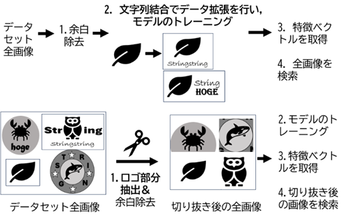
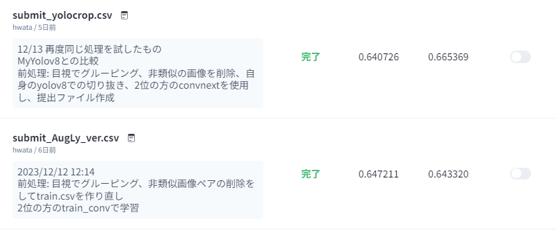

# ComparePadTextLogoToCropLogo

## 要約

本リポジトリは「類似商標画像検索システムにおける画像内の文字列処理手法の比較」の実装である．

[AI×商標：イメージサーチコンペティション（類似商標画像の検出](https://competition.nishika.com/competitions/patent/files)のデータセットを対象に２つの手法を比較した．

**提案手法1(上)：商標画像にランダムな文字列を結合**
トレーニング時にAugLyを用いて文字列を結合させることで，商標画像内の文字列に対して汎化させる手法．


**提案手法2(下)：商標画像のイラスト部分のみを抽出**
あらかじめデータセットの画像から文字列を抽出することで文字による影響を少なくする手法．

**学習**
商標画像の学習にはVision Transformerの構造を持つConvNeXtを用いたCNNモデルを用いた．

**処理の流れ**


提出ファイルは以下
- ```Yolov8_crop_ver/submission```
- ```AugLy_pad_text_to_logo_ver/submission```

**比較結果**
提案手法	Recall@20
1．文字列結合によるデータ拡張	0.643320
2．イラスト部分抽出によるデータ拡張	0.665369




**謝辞**
作成に際して以下が非常に参考になった．anyai様とhiro_jtmk様にはこの場を借りて感謝したい．

https://github.com/anyai-28/nishika_jpo_2nd_solution

https://qiita.com/hiro_jtmk/items/7eb0d864546d04e782f5


## 詳細
全てのファイルはこちらのドライブを参照
[ShareForCompetitionPaper](https://drive.google.com/drive/folders/1BQXRRhcsd-K1XoEkirexQ5FtVSx8ftzM?usp=drive_link)

### 環境
#### モデルのトレーニング時
google colab
- ubuntu22.04
- python 3.8.8
- cuda 11.8
- V100GPU high RAM

#### 提出ファイルの作成時
google colab
- ubuntu 22.04
- python 3.10.*
- cuda 11.8
- T4 GPU or V100GPU(無料版のGPUは動作未検証)

#### 自作yolov8モデルのトレーニング
google colab
- ubuntu 22.04
- python 3.10.*
- V100 GPU high memory

#### 画像切り抜きの前処理
- ubuntu 22.04
- python 3.10.*
- T4 GPU or V100GPU(無料版のGPUは動作未検証)

## トレーニングおよび精度算出方法
全てのディレクトリはこちらのドライブを参照
[ShareForCompetitionPaper](https://drive.google.com/drive/folders/1BQXRRhcsd-K1XoEkirexQ5FtVSx8ftzM?usp=drive_link)

:eyes:google colab pro, 200GB storageが必要

:bulb: ipynb内部でcontent直下にファイル構造を作成する処理をしているため，以下を自身のgoogole driveにコピーしてそのまま実行可能

modelのトレーニングには，[anyai様の実装](https://github.com/anyai-28/nishika_jpo_2nd_solution)のconvnext部分一部変更して用いた．

### AugLy_ver

- モデルのトレーニング
```AugLy_pad_text_to_logo_ver/2nd_solution_train_conv_AugLy.ipynb```

- 提出ファイルの作成
```AugLy_pad_text_to_logo_ver/make_submit_conv_AugLy.ipynb```


### Yolov8_crop_ver
- モデルのトレーニング
```Yolov8_crop_ver/2nd_solution_train_conv_yolov8.ipynb```

- 提出ファイルの作成
```Yolov8_crop_ver/make_submit_conv_yolover.ipynb```

## 前処理
### [common](https://drive.google.com/drive/folders/1KUpQ6ZyIawgALEsyzWBt4fr7s8TT62vM?usp=drive_link)
- csvやファイル構造のzipfileなど，画像ファイル以外の学習で使用するファイルをまとめたもの

### [images](https://drive.google.com/drive/folders/1JtjSTGiNfCHUg0oqX18dhp2RExMpY9r-?usp=drive_link)

#### Default
[Nishikaのデータセット](https://competition.nishika.com/competitions/patent/data)にあるcite_images.zipとapply_images.zip

#### EasyCrop
Defaultを，[Nishikaのチュートリアルコード記載の切り抜き処理](https://competition.nishika.com/competitions/patent/topics/169)で切り抜いた画像

コードは```images/make_EasyCrop.ipynb```

#### Yolov8Crop
Defaultを自作のyolov8モデルでDefaultを切り抜いた画像

自作モデル
```yolov8_train_model/best_v3_01.pt```

切り抜きモデルを公開したものとデータセットは以下
https://universe.roboflow.com/chuouniv/trademark-logo-detection

### [csv_clense](https://drive.google.com/drive/folders/1lMwqnscrC--q6YYZ0XEpIiYRMx5x-U1N?usp=drive_link)

**```my_train_w_group_label.csv```: train.csvからの変更点**
1. 類似画像をグループ化し，そのグループを正解ラベルに
2. 非類似ペアの削除

1.このコンペのテーブルデータは，画像一枚に対して，正解ラベルである一枚の画像パスが指定されている．しかし，類似画像は複数あるので，人間の目には類似に見えても，正解判定されないという問題が起こる．そこで，train_apply_imagesの画像全てに対して，手作業で類似グループを作成し，ラベルを振った．

2.目視でtrain_apply_imagesとtrain_cite_imagesの画像を見ると明らかに類似していないものがあったので，非類似ペアを除去して学習に使用した．

|gid|path|cite_gid|cite_path|category|same_group|label|
|--|--|--|--|--|--|--|
|1000289808	|1000289808/1000289808.jpg|	1000400231|	1000400231/1000400231.jpg|	3	|124_A	|717|
|1000266291|	1000266291/1000266291.jpg|	1000206509|	1000206509/1000206509.jpg|	3	|016_I	|374|
|1000485598| 1000485598/1000485598.jpg|	1000423794|	1000423794/1000423794.jpg|	3	|004_D	|107|
|1000097009| 1000097009/1000097009.jpg	|1000627155|	1000627155/1000627155.jpg|	2	|004_A	|104|


## 自作Yolov8モデル作成
### [yolov8_train_model](https://drive.google.com/drive/folders/1mMOQTBBgMN_2wPKhuu1eISCVnLGhIv25?usp=drive_link)

[Annotationしたデータセット](https://drive.google.com/file/d/1-1ORlN7z6IUjWrCZ1jvkAjl7HZgC52se/view?usp=drive_link)を用いて，trademarkのみ抽出する自作モデルを作成


最終的に切り抜きモデルとして使用するのは
```yolov8_train_model/best_v3_01.pt```

**v3_00-batch64-train-trademarkOCR.ipynb**
- 150epochsでtrademark検知モデルをトレーニング

**v3_01-batch64-train-trademarkOCR.ipynb**
- v3_00から，150epochsでtrademark検知モデルを追加でトレーニング


**再掲**
切り抜きモデルを公開したものとデータセットは以下
https://universe.roboflow.com/chuouniv/trademark-logo-detection
